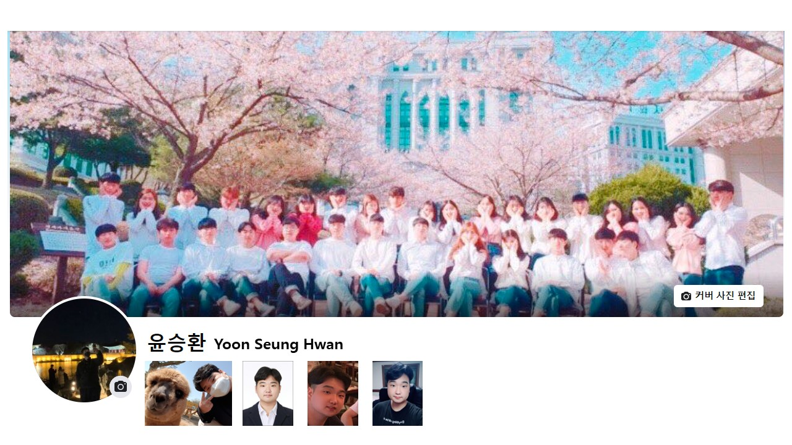

<h3 align='center'>:blue_heart: SNS list :blue_heart:

# 👻 WELCOME TO YoonSeung's DEVlog 🎉

---
  

---

### 👩🏻‍💻Front-End tech stack🛠

</a>&nbsp;
</a>&nbsp;
</a>&nbsp;
</a>&nbsp;

### 👩🏻‍💻Back-End tech stack🛠
</a>&nbsp;
</a>&nbsp;

### 👩🏻‍💻Used tools🛠
</a>&nbsp;
</a>&nbsp;
